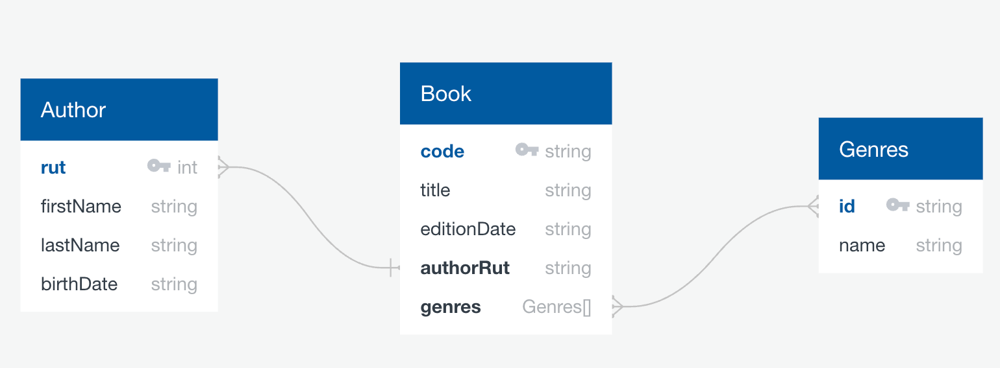

# Book Management Project with AWS SAM and GraphQL

Welcome to this example project that implements a serverless API for managing books and authors!  
Below, you will find all the information you need to:

1. Understand the **context** of the project.  
2. Review the **infrastructure** deployed with **AWS SAM**.  
3. See the **database documentation** and how relationships are handled in **DynamoDB**.  
4. Test the **GraphQL API** with query examples 
5. **Authenticate** with Amazon Cognito to make requests.  
6. Deploy and run this project in your own AWS account. 
7. Future Improvements

---

## 1. Project Context

This project implements an **API** that performs **CRUD** (Create, Read, Update, Delete) operations on a **DynamoDB** database of books:

- **Authors**: it stores first name, last name, birth date, RUT (a unique identifier).  
- **Books**: code, name, edition date, author, genres.  
- **Genres**: id, name.  
- **Bulk Deletion**: a feature to delete multiple books at once using AWS Step Functions.  
- **Authentication**: uses Amazon Cognito to protect the AppSync API. A valid **access token** is required for every request.

All resources are described and deployed using **AWS SAM (Serverless Application Model)**, following a fully serverless and scalable architecture.

---

## 2. Architecture & Infrastructure (SAM)

Within this repository, you’ll find a **SAM** (YAML) template describing the following:

1. **DynamoDB Tables**  
   - `Author` (primary key: `rut`)  
   - `Book` (primary key: `code`, with a GSI on `authorRut`)  
   - `Genres` (primary key: `id`)

2. **Lambda Functions**  
   - `AuthorLambda`: CRUD operations for authors.  
   - `BookLambda`: CRUD operations for books.  
   - `GenreLambda`: CRUD operations for genres.  
   - `BulkDeleteLambda`: invokes a Step Function to perform bulk book deletion.  
   - `DeleteBookCascadeLambda`: handles the deletion of books in a cascade (clean up related data, etc.).

3. **Step Functions**  
   - `BulkDeleteBooksStateMachine`: orchestrates the bulk deletion process, iterating over a list of book codes.

4. **AppSync (GraphQL)**  
   - A **GraphQL API** protected by Amazon Cognito User Pool.  
   - **Data Sources** pointing to each Lambda for CRUD operations.  
   - **Resolvers** for Queries and Mutations.

5. **Cognito**  
   - `CognitoUserPool` for user authentication.  
   - `CognitoUserPoolClient` and `CognitoUserPoolDomain` for the login flow and token retrieval.

With this **SAM Template**, you can **deploy** the entire infrastructure to AWS with a single command.

---

## 3. Database Structure and Relationships

### DynamoDB Tables

1. **Author**  
   - **Primary Key**: `rut` (String)  
   - Attributes: `firstName`, `lastName`, `birthdate`, etc.

2. **Book**  
   - **Primary Key**: `code` (String)  
   - Attributes: `title`, `editionDate`, `authorRut`, `genres` (array of genre IDs), etc.  
   - **GSI**: `byAuthor` based on `authorRut` (enables efficient queries by author).

3. **Genres**  
   - **Primary Key**: `id` (String)  
   - Attributes: `name`, etc.


### Conceptual Model (Relationships)



#### Current Implementation of Relationships
1. **One-to-One (1:1):** 
    - Description: Each book has a single author.
    - Implementation: The Book table contains the attribute authorRut, which references the rut of an author in the Author table.

2. **One-to-One (1:N):** 
    - Description: An author can have multiple books.
    - Implementation: Utilizes the Global Secondary Index (GSI) authorRut in the Book table, allowing efficient queries to retrieve all books associated with a specific author. 


3. **One-to-One (N:M):** 
    - Description: A book can belong to multiple genres, and a genre can be associated with multiple books.
    - Implementation: Currently managed using an array of genre IDs (genres) within the Book table. This approach allows a book to reference multiple genres directly.

---

## 4. Test the **GraphQL API** with query examples 


To interact with the GraphQL API, you need the HTTP Endpoint provided by AWS AppSync after deployment. It typically looks like:<br/>
`https://<api-id>.appsync-api.<region>.amazonaws.com/graphql`<br/>
Replace `api-id` and `region` with your specific values from the SAM deployment outputs.

### **Actions and Queries Overview Author**

| **Action** | **Description** | **Query** |
|------------|-----------------|-----------|
| **Create** | Create a new author | [View Query](#create) |
| **Find**   | Find author | [View Query](#find) |
| **List**   | List of authors | [View Query](#list) |
| **Update** | Update a author | [View Query](#update) |
| **Delete** | Delete a author | [View Query](#delete) |

---

### **Actions and Queries Overview: Books**

| **Action** | **Description** | **Query** |
|------------|-----------------|-----------|
| **Create** | Create a new book | [View Query](#create-book) |
| **Find**   | Find a book | [View Query](#find-book) |
| **List**   | List books | [View Query](#list-books) |
| **Update** | Update a book | [View Query](#update-book) |
| **Delete** | Delete a book | [View Query](#delete-book) |


---

### **Actions and Queries Overview: BulkDelete**

| **Action** | **Description** | **Query** |
|------------|-----------------|-----------|
| **DeleteCascade** | Delete cascade books | [View Query](#delete-cascade) |

---

### **Detailed Queries**
<details><summary>Author Queries</summary>

#### **Create**

**Action**: Create a new author.

**Query**:

```json
{
  "query": "mutation CreateAuthor($input: CreateAuthorInput!) { createAuthor(input: $input) { rut firstName lastName } }",
  "variables": {
    "input": {
      "rut": "12345678-9",
      "firstName": "Gabriel",
      "lastName": "García Márquez",
      "birthDate": "1927-03-06"
    }
  }
}
```

#### **Find**

**Action**: Find an author.

**Query**:

```json
{
  "query": "query GetAuthor($rut: ID!) { getAuthor(rut: $rut) { rut firstName lastName birthDate books { code title editionDate } } }",
  "variables": {
    "rut": "12345678-9"
  }
}
```

#### **List**

**Action**: List of authors.

**Query**:

```json
{
  "query": "query ListAuthors { listAuthors { rut firstName lastName birthDate books { code title editionDate } } }"
}

```

#### **Update**

**Action**: Update an author.

**Query**:

```json
{
  "query": "mutation UpdateAuthor($input: UpdateAuthorInput!) { updateAuthor(input: $input) { rut firstName lastName birthDate books { code title editionDate } } }",
  "variables": {
    "input": {
      "rut": "12345678-9",
      "lastName": "Garcia"
    }
  }
}

```

#### **Delete**

**Action**: Delete an author.

**Query**:

```json
{
  "query": "mutation DeleteAuthor($input: DeleteAuthorInput!) { deleteAuthor(input: $input) { rut } }",
  "variables": {
    "input": {
      "rut": "12345678-9"
    }
  }
}

```
</details>


<!-- SUMARY BOOKS -->
<details><summary>Books Queries</summary>

#### **Create Book**

**Action**: Create a new book.

**Query**:

```json
{
  "query": "mutation CreateBook($input: CreateBookInput!) { createBook(input: $input) { code title editionDate authorRut genres } }",
  "variables": {
    "input": {
      "code": "BOOK123",
      "title": "One Hundred Years of Solitude",
      "editionDate": "1967-05-30",
      "authorRut": "12345678-9",
      "genres": ["GENRE1", "GENRE2"]
    }
  }
}
```

#### **Find Book**

**Action**: Find a book.

**Query**:

```json
{
  "query": "query GetBook($code: ID!) { getBook(code: $code) { code title editionDate author { rut firstName lastName birthDate } genres { id name } } }",
  "variables": {
    "code": "BOOK123"
  }
}

```


#### **List Book**

**Action**: List a book.

**Query**:

```json
{
  "query": "query ListBooks { listBooks { code title editionDate author { rut firstName lastName birthDate } genres { id name } } }",
  "variables": {}
}

```


#### **Update Book**

**Action**: Create a new book.

**Query**:

```json
{
  "query": "mutation UpdateBook($input: UpdateBookInput!) { updateBook(input: $input) { code title editionDate author { rut firstName lastName birthDate } genres { id name } } }",
  "variables": {
    "input": {
      "code": "BOOK123",
      "title": "GraphQL Advanced",
      "editionDate": "2025-02-01",
      "authorRut": "12345678-9",
      "genres": ["GENRE1"]
    }
  }
}
```


#### **Delete Book**

**Action**: Create a new book.

**Query**:

```json
{
  "query": "mutation DeleteBook($input: DeleteBookInput!) { deleteBook(input: $input) { code } }",
  "variables": {
    "input": {
      "code": "BOOK123"
    }
  }
}

```


</details>


<!-- SUMARY BOOKS -->
<details><summary>BulkDelete</summary>

#### **Delete Cascade**

**Action**: Delete Cascade by books codes .

**Query**:

```json
{
  "query": "mutation bulkDelete($codes: [String!]!) { bulkDeleteBooks(codes: $codes) { executionArn message } }",
  "variables": {
    "codes": ["BOOK123", "BOOK1234"]
  }
}

```
</details>

For more details see the `schema.graphql`

---

## 5. **Authenticate** with Amazon Cognito to make requests.

1. **Create a User in Cognito**  
   - Navigate to the Amazon Cognito console.  
   - Select the User Pool created during deployment.
   - Go to the Users and groups section.
   - Click on Create user and fill in the required details (username, email, etc.).
   - Ensure the user status is ENABLED/CONFIRMED to allow immediate login.

2. **Obtain the Access Token**  
   - Access the login URL:<br/>
   `https://my-subdomain.auth.<REGION>.amazoncognito.com/login
  ?client_id=<YOUR_CLIENT_ID>
  &response_type=token
  &scope=openid%20aws.cognito.signin.user.admin
  &redirect_uri=https://localhost/callback`  
   - Enter the credentials of the user you created in Cognito..
   - Upon successful login, Cognito redirects to the specified redirect_uri with tokens appended in the URL fragment.
   - After redirection, the URL will contain the Access Token as a fragment, e.g., https://localhost/callback#access_token=<TOKEN>&id_token=<TOKEN>&.....
   - Copy the access_token from the URL. This token is essential for authenticating API requests.

3. **Use the Access Token in API Requests**
    - Include the Access Token in the Authorization header as a Bearer Token when making request


## 6. Deploying and Running the Project

Follow these steps to set up, deploy, and run the **Book Management** project on your AWS account.

### Prerequisites

- **AWS CLI** installed and configured with appropriate permissions.
- **AWS SAM CLI** installed.
- **Node.js** and **npm** (or **yarn**) installed for dependency management.
- **Git** installed for cloning the repository.

### Steps

1. **Clone the Repository**

   ```bash
   git clone <REPO-URL>
   cd <project-directory>
   ```

2. **Clone the Repository**

   ```bash
    # For root dependencies
    npm install
    # For each Lambda function
    cd src/lambdas/author
    npm install
    cd ../../book
    npm install
    npm run build
    # Repeat for other Lambdas
   ```

3. **Deploy with SAM**

   ```bash
    sam build
    sam deploy --guided
   ```

## 7. Improvements and Future Enhancements

### 7.1 Using Intermediate Tables for Many-to-Many Relationships
- **Improvement**: Implementing junction tables to manage many-to-many relationships between entities such as Books and Genres.
- **Why**: Enhances scalability and query efficiency by avoiding large attribute arrays and enabling more flexible data retrieval.

### 7.2 Incorporating Global Secondary Indexes (GSI) in GraphQL
- **Improvement**: Utilizing Global Secondary Indexes (GSI) in GraphQL queries to support additional query patterns.
- **Why**: Improves query performance and reduces read costs by enabling targeted and efficient data access based on different attributes.

### 7.3 Implementing Machine-to-Machine Authentication with Cognito
- **Improvement**: Switching to machine-to-machine (M2M) authentication using Cognito's Client Credentials flow.
- **Why**: Enhances security and allows backend services to securely interact with the API without requiring user-based tokens.

### 7.4 Enabling Multi-Region Deployment
- **Improvement**: Deploying the application across multiple AWS regions.
- **Why**: Increases availability, reduces latency for global users, and provides disaster recovery capabilities to ensure business continuity.
